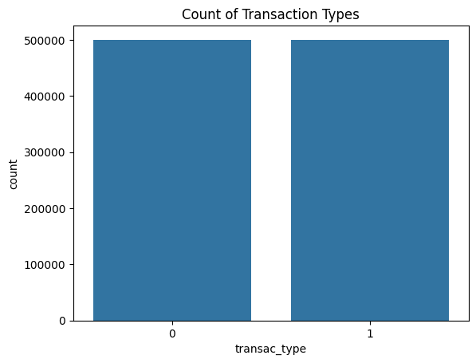
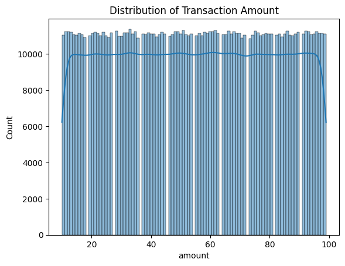
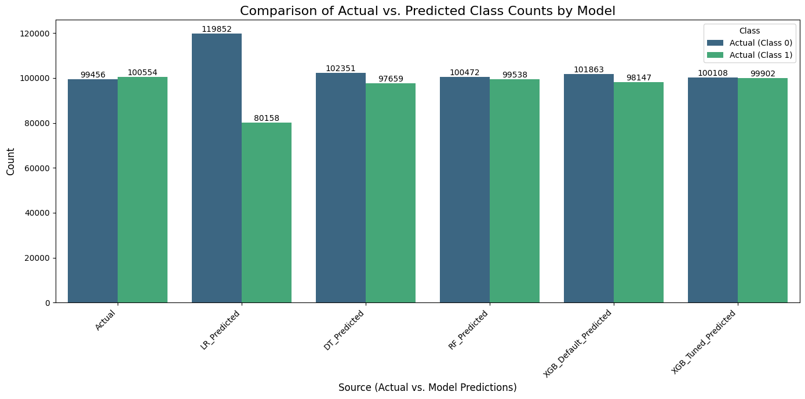
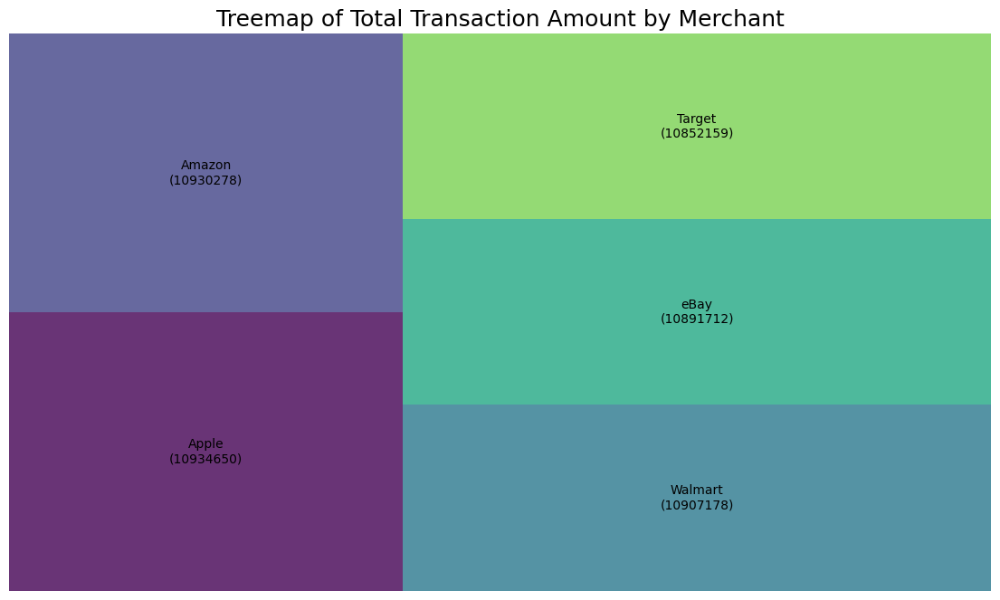

# EDA-and-Predictive-Modeling-on-Synthetic-Transaction-Data

This project simulates a large-scale synthetic transaction dataset and compares the performance of various machine learning classifiers — **Logistic Regression**, **Decision Tree**, **Random Forest**, and **XGBoost** — to predict whether a transaction belongs to a specific type (e.g., potentially fraudulent or unusual).

---

## Project Objective

To evaluate how well different ML models can classify transaction types (`transac_type`) based on transaction amount and merchant, using synthetic data. This helps assess classifier behavior when applied to random/balanced classification problems.

---

## Dataset Overview

Artificial dataset generated with **1,000,050** entries, mimicking real-world transaction behavior.

| Feature         | Description                                                                 |
|----------------|-----------------------------------------------------------------------------|
| `amount`        | Random float between 10 and 100 (transaction amount)                       |
| `merchant`      | Randomly selected from: Amazon, Walmart, Target, eBay, Apple               |
| `time`          | Random timestamp from 2020–2021 (dropped before training)                  |
| `transac_type`  | Binary target (0: normal, 1: special/fraudulent), generated with 50/50 chance |

---

## Data Preprocessing

1. **Time Conversion**: Converted `time` to Unix timestamp; later dropped as a feature.
2. **Encoding**:
   - `merchant` → One-Hot Encoded
   - `transac_type` → Binary integer label
3. **Feature Selection**: Final features = `amount + merchant_*`
4. **Train-Test Split**: 80% training, 20% testing

---

## Models Trained

| Model Name               | Type               | Purpose                                  |
|--------------------------|--------------------|------------------------------------------|
| Logistic Regression      | Linear Classifier   | Baseline model for binary classification |
| Decision Tree Classifier | Tree-based Model    | Handles non-linearity and splits on rules |
| Random Forest Classifier | Ensemble Learning   | Improves accuracy and reduces variance    |
| XGBoost Classifier       | Gradient Boosting   | High-performance, tuned using GridSearchCV|

---

## XGBoost Tuning

**GridSearchCV** was applied to XGBoost on:
- `n_estimators`: Number of trees
- `max_depth`: Tree depth
- `learning_rate`: Step size shrinkage

**Goal**: Find best combination of parameters using cross-validation accuracy.

---

## Visualizations

### 1. Transaction Types count

### 2. Distribution of Transaction Amount

### 3. Model Accuracy Comparison

### 4. Comparison of Actual vs. Predicted Class Counts by Model

### 5. Treemap of Total Transaction Amount by Merchant

